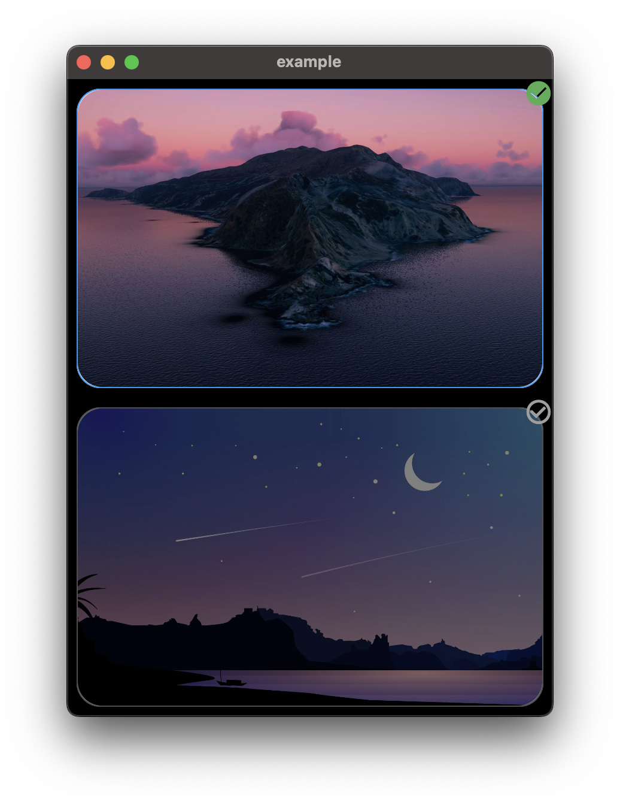

# Selectable Box

[](https://github.com/mantreshkhurana/selectable_box)
[](https://pub.dartlang.org/packages/selectable_box)

Use SelectableBox to create a selectable box in your flutter app.



## Installation

Add `selectable_box: ^1.0.3` in your project's pubspec.yaml:

```yaml
dependencies:
  selectable_box: ^1.0.3
```

## Usage

Import `selectable_box` in your dart file:

```dart
import 'package:selectable_box/selectable_box.dart';
```

Then use `SelectableBox` in your widget tree:

```dart
bool isSelected = false;

SelectableBox(
  height: 250,
  width: 400,
  color: Colors.white,
  isSelectedColor: Colors.white,
  borderColor: Colors.grey,
  isSelectedBorderColor: Colors.blue,
  borderWidth: 1,
  borderRadius: 20,
  padding: const EdgeInsets.all(8),
  animationDuration: const Duration(milliseconds: 200),
  opacity: 0.5,
  isSelectedOpacity: 1,
  checkboxAlignment: Alignment.topRight,
  checkboxPadding: const EdgeInsets.all(0),
  selectedIcon: const Icon(
    Icons.check_circle,
    color: Colors.green,
  ),
  unselectdIcon: const Icon(
    Icons.check_circle_outline,
    color: Colors.grey,
  ),
  showCheckbox: true,
  onTap: () {
    setState(() {
      isSelected = !isSelected;
    });
  },
  isSelected: isSelected,
  child: const Image(
    image: AssetImage('assets/images/1.jpg'),
    fit: BoxFit.cover,
  ),
),
```
